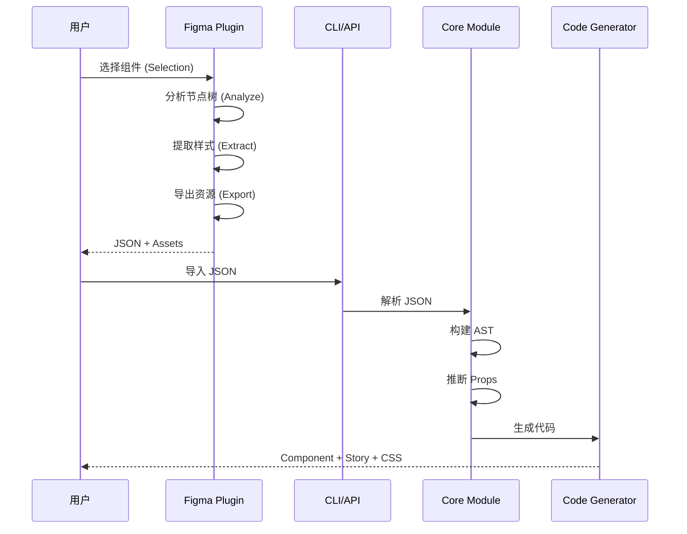
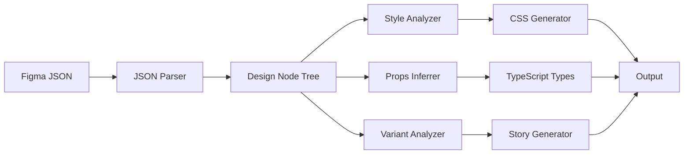

# 技术架构

## 2.1 系统架构

### 整体架构图

```
┌─────────────────────────────────────────────────────────────┐
│                      Figma Design File                       │
│                  (包含 Frames, Components)                   │
└─────────────────────┬───────────────────────────────────────┘
                      │
                      ▼
┌─────────────────────────────────────────────────────────────┐
│                  Figma Plugin (客户端)                        │
│  ┌─────────────┐  ┌─────────────┐  ┌─────────────────────┐ │
│  │ Selection   │  │  Export      │  │  Component          │ │
│  │ Handler     │  │  Manager     │  │  Analyzer           │ │
│  └─────────────┘  └─────────────┘  └─────────────────────┘ │
│                                                              │
│  输出: JSON (Figma Node Tree + Styles + Assets)               │
└─────────────────────┬───────────────────────────────────────┘
                      │
                      ▼
┌─────────────────────────────────────────────────────────────┐
│                  CLI / API (服务端)                          │
│  ┌─────────────┐  ┌─────────────┐  ┌─────────────────────┐ │
│  │ JSON        │  │  Style      │  │  Component          │ │
│  │ Parser      │  │  Converter  │  │  Generator          │ │
│  └─────────────┘  └─────────────┘  └─────────────────────┘ │
│                                                              │
│  ┌─────────────┐  ┌─────────────┐  ┌─────────────────────┐ │
│  │ Props       │  │  Story      │  │  Docs               │ │
│  │ Inferrer    │  │  Generator  │  │  Generator          │ │
│  └─────────────┘  └─────────────┘  └─────────────────────┘ │
└─────────────────────┬───────────────────────────────────────┘
                      │
                      ▼
┌─────────────────────────────────────────────────────────────┐
│                   输出产物                                   │
│  ┌──────────────────┐  ┌──────────────────────────────────┐ │
│  │ React/Vue/Angular│  │ Story Files (*.stories.tsx)      │ │
│  │ Component Code   │  │ Args Table + Controls            │ │
│  └──────────────────┘  └──────────────────────────────────┘ │
│  ┌──────────────────┐  ┌──────────────────────────────────┐ │
│  │ CSS/Tailwind     │  │ MDX Documentation               │ │
│  │ Styles           │  │ (Usage + Best Practices)         │ │
│  └──────────────────┘  └──────────────────────────────────┘ │
│  ┌──────────────────┐  ┌──────────────────────────────────┐ │
│  │ TypeScript Types  │  │ Design Tokens (JSON)            │ │
│  └──────────────────┘  └──────────────────────────────────┘ │
└─────────────────────────────────────────────────────────────┘
```

### 模块职责

#### Figma Plugin 模块

| 模块 | 职责 | 输入 | 输出 |
|------|------|------|------|
| Selection Handler | 处理用户选中节点 | Figma Selection | SelectedNodes[] |
| Export Manager | 管理导出流程 | Nodes | JSON + Assets |
| Component Analyzer | 分析组件结构 | Node | ComponentMetadata |

#### CLI/API 模块

| 模块 | 职责 | 输入 | 输出 |
|------|------|------|------|
| JSON Parser | 解析 Figma JSON | JSON | DesignNode[] |
| Style Converter | 转换样式 | FigmaStyles | CSS/Tailwind |
| Component Generator | 生成组件代码 | DesignNode | GeneratedCode |
| Props Inferrer | 推断 Props | DesignNode | PropDefinition[] |
| Story Generator | 生成 Story | GeneratedCode | StoryFile |
| Docs Generator | 生成文档 | GeneratedCode | MDXContent |

## 2.2 技术栈

### 技术选型

| 层级 | 技术选型 | 版本 | 理由 |
|------|----------|------|------|
| **Plugin UI** | React | 18.x | Figma 官方推荐 |
| **Plugin Logic** | TypeScript | 5.x | 类型安全 |
| **Core Logic** | TypeScript | 5.x | 跨平台、类型安全 |
| **Code Gen** | ts-morph | ^20.x | AST 操作 |
| **CLI** | Commander.js | ^11.x | 成熟的 CLI 框架 |
| **Bundler** | esbuild | ^0.25.x | 极速打包 |
| **Testing** | Vitest | ^2.x | 快速、兼容 Jest |
| **E2E Testing** | Playwright | ^1.x | 现代 E2E 测试 |

### 依赖关系

```
@design-to-storybook/
├── @design-to-storybook/core          # 核心转换逻辑
│   └── 依赖: ts-morph, typescript
│
├── @design-to-storybook/react         # React 代码生成器
│   └── 依赖: @design-to-storybook/core
│
├── @design-to-storybook/vue           # Vue 代码生成器
│   └── 依赖: @design-to-storybook/core
│
├── @design-to-storybook/angular       # Angular 代码生成器
│   └── 依赖: @design-to-storybook/core
│
├── @design-to-storybook/cli           # 命令行工具
│   └── 依赖: @design-to-storybook/core, commander
│
├── @design-to-storybook/figma-plugin  # Figma 插件
│   └── 依赖: @design-to-storybook/core
│
└── @design-to-storybook/vscode        # VS Code 扩展 (可选)
    └── 依赖: @design-to-storybook/core
```

## 2.3 数据流

### 设计提取流程



### 代码生成流程



## 2.4 核心数据结构

### DesignNode

```typescript
interface DesignNode {
  id: string;
  name: string;
  type: FigmaNodeType;
  absoluteBoundingBox?: {
    x: number;
    y: number;
    width: number;
    height: number;
  };
  fills?: Paint[];
  strokes?: Paint[];
  effects?: Effect[];
  cornerRadius?: number;
  opacity?: number;
  children?: DesignNode[];

  // 组件特有
  componentProperties?: Record<string, ComponentProperty>;
  variantProperties?: Record<string, string>;
}

type FigmaNodeType =
  | 'DOCUMENT'
  | 'CANVAS'
  | 'FRAME'
  | 'GROUP'
  | 'COMPONENT'
  | 'COMPONENT_SET'
  | 'INSTANCE'
  | 'BOOLEAN_OPERATION'
  | 'VECTOR'
  | 'STAR'
  | 'LINE'
  | 'ELLIPSE'
  | 'RECTANGLE'
  | 'TEXT'
  | 'STICKY'
  | 'WIDGET';
```

### ComponentProperty

```typescript
interface ComponentProperty {
  type: 'BOOLEAN' | 'TEXT' | 'INSTANCE_SWAP' | 'VARIANT' | 'COMPONENT';
  defaultValue?: unknown;
  variantOptions?: string[];
  preferredValues?: ComponentPropertyDefinition[];
}
```

### GeneratedCode

```typescript
interface GeneratedCode {
  // 组件代码
  code: string;
  language: 'tsx' | 'vue' | 'angular';

  // 类型定义
  types: TypeDefinition[];

  // Props 定义
  props: PropDefinition[];

  // 样式
  styles: StyleDefinition;

  // Story
  stories: StoryDefinition[];

  // 元数据
  metadata: {
    source: string;      // Figma 节点 ID
    framework: string;    // 目标框架
    generatedAt: Date;
  };
}
```

### PropDefinition

```typescript
interface PropDefinition {
  name: string;
  type: string;
  required: boolean;
  defaultValue?: unknown;
  description?: string;
  control?: ControlConfig;
  enum?: string[];
}
```

## 2.5 API 设计

### CLI 命令

```bash
# 转换命令
design-to-storybook convert <input> [options]

# 选项
Options:
  -o, --output <dir>      输出目录 (default: "./components")
  -f, --framework <name> 目标框架 (react|vue|angular) (default: "react")
  -s, --style <type>      样式格式 (css|tailwind|styled) (default: "css")
  --include-stories       包含 Story 文件 (default: true)
  --include-docs           包含 MDX 文档 (default: false)
  --extract-tokens         提取设计 Token (default: true)
  -v, --verbose            详细输出

# 示例
design-to-storybook convert ./design.json -o ./components -f react -s tailwind
```

### Programmatic API

```typescript
import { convert } from '@design-to-storybook/core';

const result = await convert({
  input: './design.json',
  framework: 'react',
  style: 'css',
  includeStories: true,
  extractTokens: true,
});

console.log(result.components);
console.log(result.tokens);
```

### Plugin ↔ CLI 协议

```typescript
// Plugin 输出格式
interface PluginExport {
  version: '1.0';
  generatedAt: string;
  source: {
    fileKey: string;
    nodeId: string;
    fileName: string;
  };
  nodes: DesignNode[];
  styles: {
    colors: ColorToken[];
    typography: TypographyToken[];
    spacing: SpacingToken[];
  };
  assets: {
    images: ImageAsset[];
    icons: IconAsset[];
  };
}
```
