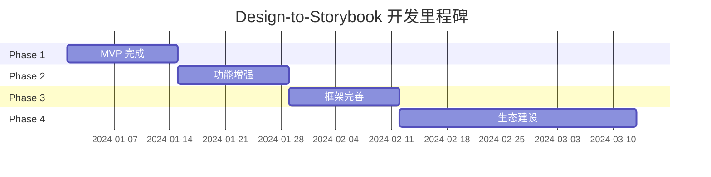

# 开发路线图

## 4.1 整体规划

### 开发周期

```
Phase 1: MVP                Phase 2: 增强              Phase 3: 完善              Phase 4: 生态
─────────────────────      ─────────────────────      ─────────────────────      ─────────────────────
Week 1-2                   Week 3-4                   Week 5-6                   持续迭代
基础框架搭建                Variant 支持               Angular 支持               CLI 完善
核心元素提取                CSS/Tailwind 导出          Token 提取                 VS Code 扩展
React 组件生成              TypeScript 推断            MDX 文档生成               CI/CD 集成
Story 生成                  Vue 3 支持                 错误处理                   社区插件
单组件测试验证              交互状态导出               性能优化                   文档完善
```

## 4.2 Phase 1: MVP

### 目标
实现最小可行产品，支持从 Figma 到 React 组件的完整转换流程。

### 时间
2 周

### 任务清单

| 任务 | 描述 | 优先级 | 预估工时 |
|------|------|--------|----------|
| 1.1 项目初始化 | 创建 monorepo 结构，配置 TypeScript、ESBuild、Vitest | P0 | 2h |
| 1.2 Figma Plugin 框架 | 搭建 Plugin 基础框架，配置开发环境 | P0 | 4h |
| 1.3 节点提取器 | 实现 Frame、Rectangle、Text、Vector 元素提取 | P0 | 8h |
| 1.4 样式提取器 | 实现 fills、strokes、effects 提取 | P0 | 6h |
| 1.5 React 组件生成器 | 生成基础 React 组件代码 | P0 | 8h |
| 1.6 Story 生成器 | 生成 Storybook Story 文件 | P0 | 6h |
| 1.7 CSS 样式导出 | 生成标准 CSS 样式 | P0 | 4h |
| 1.8 CLI 工具 | 实现命令行转换工具 | P1 | 4h |
| 1.9 集成测试 | 端到端测试完整流程 | P0 | 4h |

### 验收标准
- [ ] Figma Plugin 可正常导出 JSON
- [ ] 简单组件（Button、Input）可成功转换为 React 代码
- [ ] 生成的 Story 可在 Storybook 中正常渲染
- [ ] CLI 命令可正常执行

### 产出物
- `@design-to-storybook/core` 包
- `@design-to-storybook/figma-plugin` 插件
- `@design-to-storybook/react` 包
- `@design-to-storybook/cli` 工具

## 4.3 Phase 2: 增强

### 目标
增强功能支持，处理复杂组件场景，提升代码质量。

### 时间
2 周

### 任务清单

| 任务 | 描述 | 优先级 | 预估工时 |
|------|------|--------|----------|
| 2.1 Variant 支持 | 处理 COMPONENT_SET 和 Variant 组件 | P0 | 8h |
| 2.2 Component Properties | 映射 Figma Component Properties 到 React Props | P0 | 6h |
| 2.3 Tailwind 导出 | 支持 Tailwind CSS 样式生成 | P1 | 6h |
| 2.4 TypeScript 推断 | 自动推断 Props 类型定义 | P0 | 8h |
| 2.5 Vue 3 支持 | 实现 Vue 3 组件生成器 | P1 | 8h |
| 2.6 交互状态导出 | 提取 hover、focus、active 等状态 | P1 | 4h |
| 2.7 错误处理 | 完善异常处理和用户提示 | P1 | 4h |

### 验收标准
- [ ] Variant 组件可生成多个 Story
- [ ] TypeScript 类型无错误
- [ ] 可切换生成 React 或 Vue 代码
- [ ] 可切换生成 CSS 或 Tailwind 样式

### 产出物
- `@design-to-storybook/vue` 包
- 增强的 TypeScript 类型支持
- Tailwind 样式生成器

## 4.4 Phase 3: 完善

### 目标
完善框架支持，增加辅助功能，提升用户体验。

### 时间
2 周

### 任务清单

| 任务 | 描述 | 优先级 | 预估工时 |
|------|------|--------|----------|
| 3.1 Angular 支持 | 实现 Angular 组件生成器 | P2 | 12h |
| 3.2 设计 Token 提取 | 提取颜色、字体、间距等设计变量 | P1 | 6h |
| 3.3 MDX 文档生成 | 自动生成组件使用文档 | P2 | 8h |
| 3.4 配置化 | 支持配置文件自定义转换规则 | P2 | 6h |
| 3.5 预览功能 | Plugin 内置设计预览 | P2 | 6h |
| 3.6 性能优化 | 大型组件树处理优化 | P1 | 4h |

### 验收标准
- [ ] 支持 Angular 组件生成
- [ ] 可提取完整的设计 Token
- [ ] 可生成 MDX 文档
- [ ] 性能满足大型项目需求

### 产出物
- `@design-to-storybook/angular` 包
- 设计 Token 导出功能
- MDX 文档生成器

## 4.5 Phase 4: 生态

### 目标
构建开发者生态，提供扩展能力和配套工具。

### 时间
持续迭代

### 任务清单

| 任务 | 描述 | 优先级 | 状态 |
|------|------|--------|------|
| 4.1 CLI 完善 | 增强 CLI 功能（watch 模式、交互式选择） | P1 | 待开始 |
| 4.2 VS Code Extension | VS Code 内直接转换 | P2 | 待开始 |
| 4.3 CI/CD 集成 | GitHub Action / GitLab CI 模板 | P2 | 待开始 |
| 4.4 插件系统 | 支持自定义转换规则和处理器 | P2 | 待开始 |
| 4.5 社区文档 | 使用指南、最佳实践、案例 | P1 | 待开始 |
| 4.6 双向同步 | Design ↔ Code 双向同步 | P3 | 规划中 |

## 4.6 技术债务

### 需要处理的技术债务

| 债务项 | 描述 | 优先级 | 预估 |
|------|------|--------|------|
| 测试覆盖率 | 当前缺少足够的单元测试 | P1 | 1周 |
| 文档完善 | API 文档和使用指南 | P1 | 持续 |
| 错误消息 | 用户友好的错误提示 | P2 | 0.5周 |
| 类型定义 | 完善导出类型定义 | P2 | 0.5周 |

## 4.7 发布计划

### 包结构

```
@design-to-storybook/
├── @design-to-storybook/core          # 核心转换逻辑
├── @design-to-storybook/react         # React 代码生成器
├── @design-to-storybook/vue           # Vue 代码生成器
├── @design-to-storybook/angular       # Angular 代码生成器
├── @design-to-storybook/cli           # 命令行工具
├── @design-to-storybook/figma-plugin  # Figma 插件
├── @design-to-storybook/vscode        # VS Code 扩展 (可选)
└── @design-to-storybook/templates    # 项目模板
```

### 发布节奏

| 版本 | 内容 | 目标时间 |
|------|------|----------|
| v0.1.0 | MVP 发布，React 支持 | Week 2 |
| v0.2.0 | Variant 支持，Vue 3 支持 | Week 4 |
| v0.3.0 | Angular 支持，Token 提取 | Week 6 |
| v1.0.0 | 正式版发布 | Week 8 |

### NPM 发布

```bash
# 发布脚本
pnpm publish --access public --registry https://registry.npmjs.org/

# 每个包单独发布
cd packages/core && pnpm publish
cd packages/react && pnpm publish
cd packages/cli && pnpm publish
```

## 4.8 里程碑



## 4.9 风险管理

| 风险 | 影响 | 缓解措施 |
|------|------|----------|
| Figma API 变更 | 高 | 预留适配层，隔离 API 依赖 |
| 代码生成质量问题 | 中 | 持续人工评估，建立评分体系 |
| 维护成本高 | 中 | 清晰的代码结构，自动化测试 |
| 社区参与度低 | 低 | 积极运营，持续迭代 |
